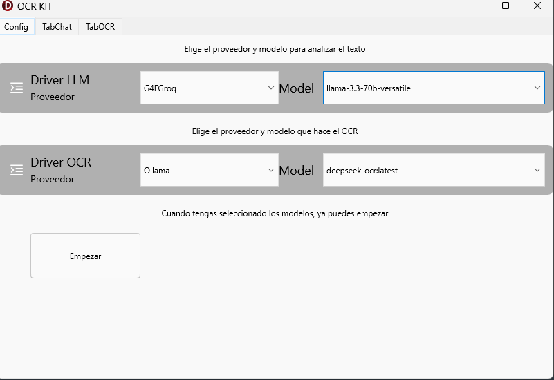
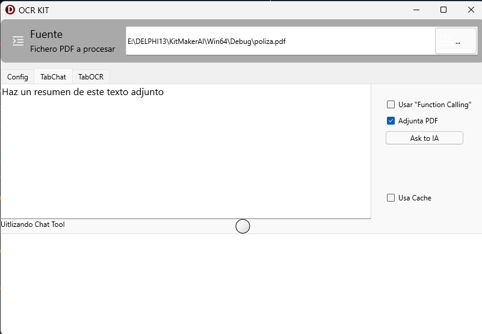
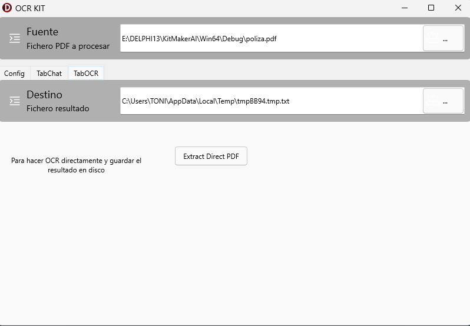

# MiKitOCRDemo

# 🌟 Overview

El proyecto es una compilacion de ideas, usando MakerAi, Pdfium4D, y algo más.

La intención es que sirva de semilla para el desarrollo de diferentes
herramientas y complementos para  MakerAI.

Probado en Windows64 y Android64 .

## KitMaker Sample

Selecciona los modelos a usar.

  

Selecciona el archivo a adjuntar en chat

  

Realiza OCR directo

  

#  Instalacion

## MITPackMakerAI

Compila  MITPackMakerAI.dpk, para instalar los nuevos componentes.

## uMakerAi.Chat.G4F

     Registra varios proveedores de acceso abierto aunque limitado.

     https://github.com/xtekky/gpt4free

     https://g4f.dev/

     TAiG4FOllama,TAiG4FPollinations,TAiG4FNvidia,TAiG4FGroqChat,TAiG4FGemini

##  uMakerAI.Ollama.PdfIUM

Es una modificacion de la idea original  uMakerAI.Ollama.Pdf.

* TAiOllamaPdfIUMTool.

Usa la libreria pdfium.dll para extraer las imagenes de los pdf.
** libpdfium.so em Amdroid

* TAiDelegaOcrTool ,

Parecido a TAiOllamaOcrTool, pero delegando el OCR a  otro TAiChatConnection.

## DX.Pdf.Dynamic y KitMaker.Pdf.Extractor

Es una adaptacion del proyecto https://github.com/omonien/DX-Pdfium4D,
para usar la libreria   pdfium.dll de forma dinamica en lugar de
estaticamente del proyecto original.

https://github.com/bblanchon/pdfium-binaries/releases

## Futuro

* Integrar librerias python como PyPDF2.
* Integrar Voz.
* MCP
* Orquestacion
